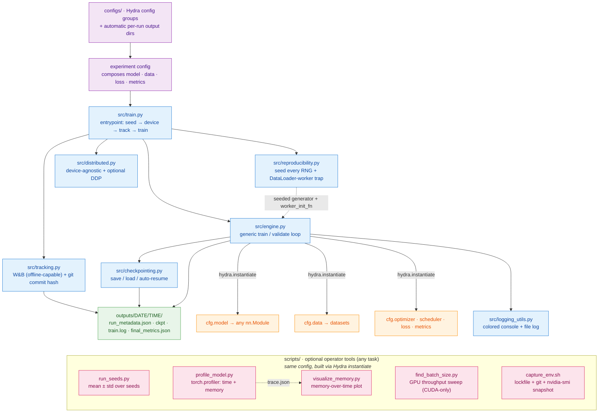

# Deep Learning Experiments Template

A small, opinionated, **task-independent** scaffold for running deep-learning experiments that other people (and future-you) can actually reproduce. There is no model or dataset here on purpose — you plug in your own via config.
A complete worked example (a Vision Transformer on FashionMNIST) lives on the [`example`](#the-example-branch) branch.
It is built to be **portable**: The same code runs on a laptop CPU, in Colab, and on a cluster (because nothing hard-codes `.cuda()` or a path).

Reproducibility is engineered across five layers, described in detail in [`docs/reproducibility.md`](docs/reproducibility.md).

## Architecture at a glance

Each box is a **clickable link to its source**. Config flows down into the entrypoint; the engine builds the task pieces from config and runs a device-agnostic loop; every run drops a provenance-stamped directory.



> The orange boxes are the **plug-in points**: on `main` they default to `???` (no task).
> The `example` branch fills them with a ViT on FashionMNIST.

## Quickstart

This template uses [`uv`](https://docs.astral.sh/uv/) (the lockfile is the portable
contract). `conda` works too — `conda env export > environment.yml` is the equivalent
locking step.

```bash
uv sync                     # install the exact, pinned environment
uv run python -m src.train  # on `main`: fails fast (see below)
```

On `main` there is no task, so `model` / `data` / `loss` are mandatory-missing
(`???`). Trying to run fails fast with a clear, self-documenting message.
Switch to the `example` branch for a real, runnable experiment.

## Portability notes

- **Device-agnostic.** Everything routes through `get_device()`
  (`cuda` → `mps` → `cpu`). The same command runs anywhere; override explicitly with
  `trainer.device=cpu`. Results will **not** be bitwise-identical across CPU/GPU or
  across GPU models — that is expected, and is why you report mean ± std over seeds.
- **No hard-coded paths.** Data location is config-driven
  (`data_dir: ${oc.env:DATA_DIR,./data}`): a Drive mount on Colab, scratch vs home on a
  cluster. Set `DATA_DIR` or override on the CLI.
- **Per-run directories.** Hydra creates `outputs/<date>/<time>/` for every run, so
  "send me your run dir" works identically everywhere.

## Extending it

Add a model/dataset/loss by writing config whose `_target_` points at your class — the
engine instantiates it with `hydra.utils.instantiate`, so **no engine code changes**.
Step-by-step in [`docs/extending.md`](docs/extending.md).

## Convenience tools

All read the same `+experiment=...` config and build the model/data via `instantiate`,
so they work for **any** task:

```bash
# Multi-seed runner — report mean ± std, not one number
uv run python scripts/run_seeds.py +experiment=<exp> --seeds 0 1 2 3 4

# PyTorch profiler — where time & memory go (CPU or GPU); writes a Chrome trace AND
# a memory-over-time plot (memory_timeline.png). "Report your compute budget"
# (Dodge et al., Show Your Work) made concrete. Memory plot needs: uv sync --extra viz
uv run python scripts/profile_model.py +experiment=<exp>

# Re-plot memory from any existing trace (or compare runs)
uv run python scripts/visualize_memory.py outputs/DATE/TIME/trace.json

# Batch-size finder — sweeps for best GPU throughput (CUDA only; skips on CPU/MPS)
uv run python scripts/find_batch_size.py +experiment=<exp>

# Environment snapshot — lockfile + git + nvidia-smi for a run's forensics
scripts/capture_env.sh ./env_capture
```

## The `example` branch

```bash
git switch example
uv sync
uv run python -m src.train +experiment=fashion_mnist_vit trainer.epochs=1 trainer.device=cpu
uv run python scripts/demo_determinism.py     # two runs diverge, then converge
uv run python scripts/run_seeds.py +experiment=fashion_mnist_vit --seeds 0 1 2
```

New to the repo (or a student)? Start with the hands-on
[**student guide**](https://github.com/SvenLigensa/dl-experiments/blob/example/docs/student_guide.md)
on the `example` branch — a "break it, then fix it" walkthrough of all five layers.

## Tooling choices (and alternatives)

- **Environments:** `uv` here; `conda`/Poetry are fine equivalents — the point is a
  *lockfile*, not loose pins.
- **Tracking:** `wandb` here, defaulting to offline mode (`wandb sync` later) so it
  works on air-gapped cluster nodes. `mlflow` (logs to a local `./mlruns`, no account)
  and `tensorboard` (minimal, local) are drop-in alternatives — see `src/tracking.py`.
- **Config:** Hydra + OmegaConf.

## Layout

```
configs/        Hydra config groups (trainer, optimizer, scheduler, model, data, loss)
src/            The framework
  reproducibility.py  seeding + determinism (the centerpiece)
  engine.py           generic, device-agnostic train/validate loop
  train.py            Hydra entrypoint
  tracking.py         W&B + git provenance
  distributed.py      device-agnostic helpers + optional DDP
  checkpointing.py    save / load / auto-resume
  logging_utils.py    colored console + file logger
  memory_viz.py       parse a profiler trace + plot allocated/reserved memory
scripts/
  run_seeds.py        mean ± std
  profile_model.py    PyTorch profiler
  visualize_memory.py memory-over-time plot
  find_batch_size.py  GPU throughput sweep
  capture_env.sh
docs/           reproducibility.md (concepts), extending.md (add your own task)
```
